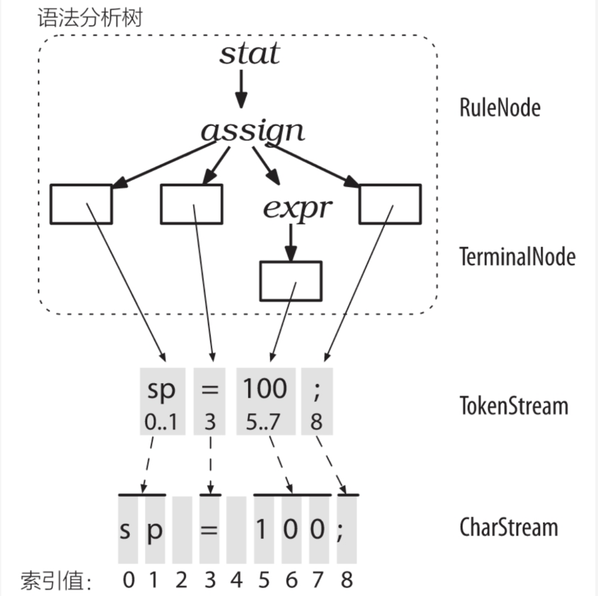
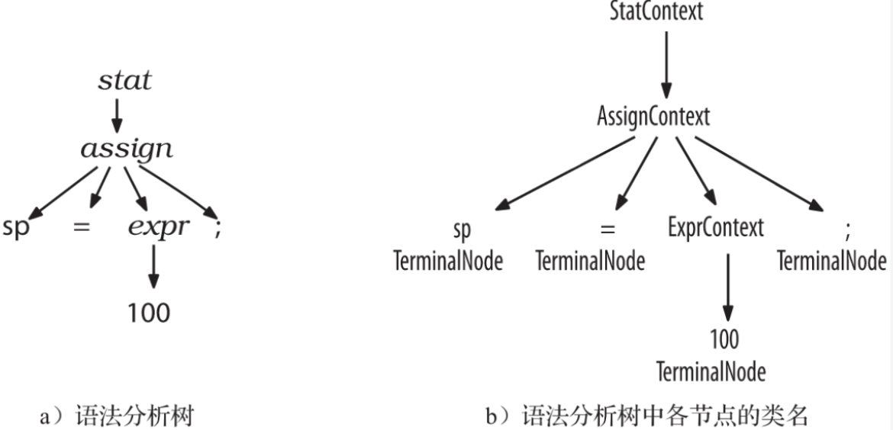
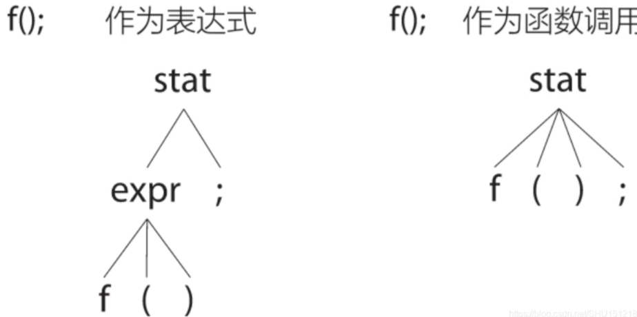

#### playscript-cpp 编译使用
- cd build 目录
- cmake ..
- make

#### 语法规则定义
```
grammar calculator;

start:
    expression EOF
    ;

expression:
    | INT
    | expression (PLUS | MINUS) expression
    ;

PLUS    :   '+';
MINUS   :   '-';
INT     :   '0'..'9'+;
```
#### 解析的整体流程
- 首先是词法分析器处理字符序列（对应CharStream类），生成Token流（对应TokenStream类，这是连接词法分析和语法分析过程的桥梁）传给语法分析器
- 语法分析器再用它检查语法正确性，然后解析得到语法树（叶子结点对应TerminalNode类，非叶子结点对应RuleNode类
- 
- 在词法分析之后，不仅要标记一个个Token，还需要记录这些Token对应的具体内容（比如知道是一个变量，也要记录变量名是什么）
- ANTLR的做法是不去记录这个字符串，而是像上图一样，首先为字符流记录一个个位置号，然后在TokenStream里记录这个Token对应的字符开始和结束的索引。
- 在生成的语法树中，叶子结点TerminalNode就是要记录这些Token的具体值（的起止索引）了，而对于非叶子结点RuleNode，则会根据不同的语法规则生成不同的子类
- 即 *Context的类，*处是.g4文件中语法规则的名字首字母大写
- 例子
  ```
  assign : ID   =   expr   ;
  ```
  - 上面的赋值语句解析出的语法分析树上各个结点的类
  - 根节点是stat语法规则（表示语句）生成的StatContxt类，它的子结点是assign语法规则（表示赋值）生成的AssignContext类
  - 图例
    - 
    - 对于标识符ID和具体符号=和;都无法继续展开，因此会作为树的叶子，并使用TerminalNode记录
    - 表达式expr可以再展开，在这里为了解析100，它选择了其中一个与之匹配的分支（整形数值）
    - 因此它生成唯一孩子TerminalNode记录这个100
    - 这些生成的*Context类（作为生成的语法Parser的静态内部类）可以访问它所对应的词组中的所有元素（图中它的子树）
    - 例如，上图的AssignContext类就可以通过ID()方法访问标识符子结点（返回值是TerminalNode类型），通过expr()方法访问表达式子树（返回值是ExprContext类型）

#### 语法分析器的工作过程
- ANTLR根据给出的语法规则，生成一个递归下降的语法分析器，当待解析的语法规则有多条分支时
- 语法分析器会去前瞻词法符号（不必是LL(1)，可以前瞻若干个词法符号），这个过程和手写的Parser是类似的
```
stat: assign
    |	ifstat
    |	whilestat
    ...
    ;
```
- 这表示语句（stat）可以是赋值语句（assign），可以是IF语句（ifstat），可以是WHILE语句（whilestat）或者其它语句
- 仅就这三条而言，它们的第一个词法符号分别是标识符、IF关键字、WHILE关键字，因此可以前瞻一个词法符号解决
- 解析stat的逻辑是
    ```
    void stat() {
        switch(/*当前输入的词法符号*/) {
            case ID : assign(); break;
            case IF : ifstat(); break;
            case WHILE : whilestat(); break;
            ...
            default: /*全都匹配不上，抛出异常*/
        }
    }   
    ```

#### 歧义处理方法
- 如果可以通过多条分支解析输入的文本，那么就说明输入文本是有歧义的，可以有多种语义去解释
- 例子
    ```
    stat : expr ';'			// 表达式语句
        | ID '(' ')' ';'	// 函数调用语句
        ;
    expr : ID '(' ')'
        | INT
        ;
    ```
    - 对于输入f();，可以走stat的第一条分支，将f()当作一个表达式expr来解析，此时f();被认为是一个表达式语句
    - 也可以走stat的第二条分支，此时f();被认为是一个函数调用语句，其中标识符f被视为函数名
    - 
    - ANTLR解决语法歧义的方法是，匹配所有可匹配分支的第一条。因此对于刚刚的例子，会将f();作为表达式解析
- Token匹配时的歧义
  - 最常见的是语法关键字和标识符之间的歧义，例如:
    ```
    BEGIN : 'begin';
    ID : [a-z]+;
    ```
    - 这表示BEGIN关键字匹配begin序列，标识符匹配一个至多个小写字母序列
    - ANTLR解决Token歧义的方法是，匹配定义最靠前的语法规则
    - 利用这一点可以自然的保证begin不能作为标识符的问题，因为BEGIN的声明就在ID的前面
    - 词法分析器在匹配Token时是贪婪模式的，即会尽可能匹配一个最长的字符串来生成Token，因此beginner会匹配为ID，而不是BEGIN后面接名为ner的标识符
- 语言语法本身的歧义
  - 其一是表达式优先级的歧义，如
    ```
    1+2∗3
    ```
    - 在这里就是自左向右处理（因此计算出来是9），在其它语言里*优先级高于+（因此计算出来是7）
    - 因此如何隐式指定表达式运算符优先级是一个问题
  - 另一种是C语言里的
    - 如i * j;中 * 是乘号还是指针符号，取决于i的Token是一个表达式还是一个类型（比如int * j;就是定义指针变量，8 * j;则是一个表达式语句）
    - 也就是说这类歧义要通过检查上下文信息解决