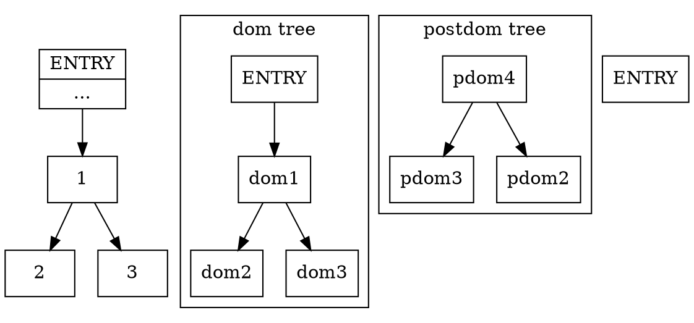
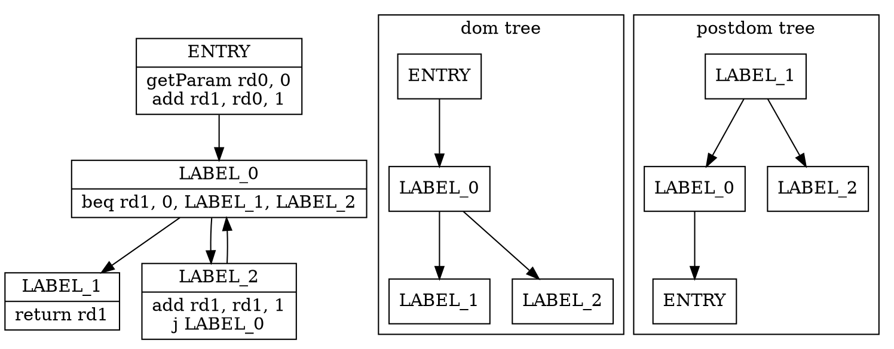
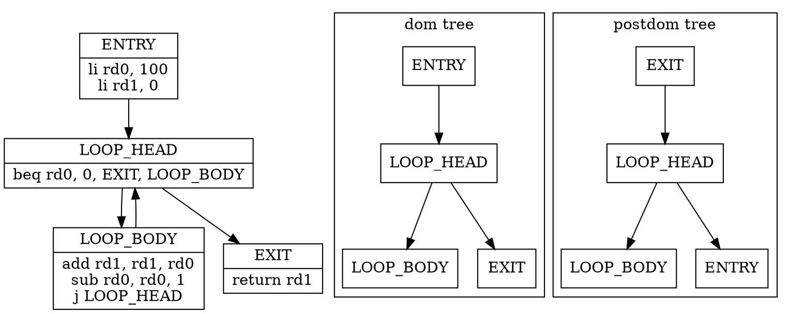
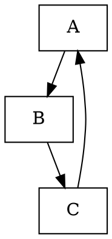

# `to_dot` 函数分析报告

## 函数作用概述

`to_dot` 函数是**控制流图可视化**（Control Flow Graph Visualization）的核心实现。该函数的主要作用是将控制流图（CFG）转换为 **Graphviz DOT 格式**的字符串，用于生成可视化的控制流图、支配树和后支配树。这是编译器调试和优化分析的重要工具。

具体来说，`to_dot` 函数的主要作用是：
1. **控制流图可视化**：生成基本块之间的控制流边
2. **支配树可视化**：显示正向支配关系（Dominance Tree）
3. **后支配树可视化**：显示反向支配关系（Post-Dominance Tree）
4. **指令格式化**：将基本块中的指令格式化为可读的文本
5. **图结构生成**：生成完整的 Graphviz DOT 格式字符串

## 每行代码详细注释

```rust
/// `to_dot` 函数：将控制流图转换为 Graphviz DOT 格式字符串
/// 
/// 返回值：String - Graphviz DOT 格式的字符串
/// 
/// 功能：生成控制流图、支配树和后支配树的可视化表示
/// 使用 Graphviz DOT 语言描述图结构，可用于生成 PNG、SVG 等格式的图像
pub fn to_dot(&self) -> String {
    // 步骤1：初始化字符串构建器
    // adjacencies: 存储控制流边（基本块之间的跳转关系）
    let mut adjacencies = String::new();
    
    // attributes: 存储节点属性（基本块标签和指令内容）
    let mut attributes = String::new();
    
    // dominance: 存储支配树边（正向支配关系）
    let mut dominance = String::new();
    
    // postdominance: 存储后支配树边（反向支配关系）
    let mut postdominance = String::new();

    // 步骤2：遍历所有基本块，构建图结构
    for (i, block) in self.blocks.iter().enumerate() {
        // 步骤2.1：构建控制流边
        // 格式：源块索引 -> 目标块索引
        // 例如：0->1 表示块0跳转到块1
        adjacencies.extend(block.children.iter().map(|j| format!("{i}->{j}\n")));
        
        // 步骤2.2：构建节点属性
        attributes.push_str(&format!(
            "{i}[label=\"{{{0}|{1}}}\"]\ndom{i}[label=\"{0}\"]\npdom{i}[label=\"{0}\"]\n",
            block.label,  // 基本块标签（如 "ENTRY"、"EXIT"、"LABEL_0"）
            // 格式化基本块中的指令
            Displayable(&block.body)
                .to_string()
                .chars()
                .filter(|&c| c != '\t')  // 移除制表符
                .flat_map(|c| match c {
                    '\n' => "\\n".chars().collect(),  // 换行符转义为 \n
                    '<' => "\\<".chars().collect(),   // 小于号转义为 \<
                    c => vec![c],                     // 其他字符保持不变
                })
                .collect::<String>()  // 收集为字符串
        ));
        
        // 步骤2.3：构建支配树边
        // 格式：支配者 -> 被支配者
        // 例如：dom0->dom1 表示块0支配块1
        if let Some(idom) = block.idom {
            dominance.push_str(&format!("dom{}->dom{i}\n", idom));
        }
        
        // 步骤2.4：构建后支配树边
        // 格式：后支配者 -> 被后支配者
        // 例如：pdom4->pdom3 表示块4后支配块3
        if let Some(idom) = block.r_idom {
            postdominance.push_str(&format!("pdom{}->pdom{i}\n", idom))
        }
    }
    
    // 步骤3：构建完整的 DOT 格式字符串
    format!(
        "
digraph G {{
node [shape=record]

{adjacencies}

subgraph cluster_dominance {{
label=\"dom tree\"
{dominance}
}}

subgraph cluster_postdominance {{
label=\"postdom tree\"
{postdominance}
}}

{attributes}}}"
    )
}
```

## 算法流程详解

### 步骤1：数据结构初始化

#### 字符串构建器
- **adjacencies**：控制流边
  - 格式：`源索引->目标索引`
  - 示例：`0->1`、`1->2`、`1->3`
- **attributes**：节点属性
  - 格式：`索引[label="{标签|指令}"]`
  - 示例：`0[label="{ENTRY|...}"]`
- **dominance**：支配树边
  - 格式：`dom源索引->dom目标索引`
  - 示例：`dom0->dom1`
- **postdominance**：后支配树边
  - 格式：`pdom源索引->pdom目标索引`
  - 示例：`pdom4->pdom3`

### 步骤2：基本块遍历

#### 控制流边生成
```rust
adjacencies.extend(block.children.iter().map(|j| format!("{i}->{j}\n")));
```
**示例**：
```
基本块0：children = [1, 2]
生成：0->1\n0->2\n
```

#### 节点属性生成
```rust
"{i}[label=\"{{{0}|{1}}}\"]\ndom{i}[label=\"{0}\"]\npdom{i}[label=\"{0}\"]\n"
```
**格式说明**：
- `{i}`：基本块索引
- `{0}`：基本块标签（block.label）
- `{1}`：格式化后的指令序列

**示例**：
```
0[label="{ENTRY|getParam rd0, 0\nadd rd1, rd0, 1\n}"]
dom0[label="ENTRY"]
pdom0[label="ENTRY"]
```

#### 指令格式化
```rust
Displayable(&block.body)
    .to_string()
    .chars()
    .filter(|&c| c != '\t')  // 移除制表符
    .flat_map(|c| match c {
        '\n' => "\\n".chars().collect(),  // 换行符转义
        '<' => "\\<".chars().collect(),   // HTML 转义
        c => vec![c],
    })
    .collect::<String>()
```
**转义规则**：
- `\t` → 移除（制表符）
- `\n` → `\\n`（换行符转义）
- `<` → `\\<`（HTML 转义）

#### 支配关系边生成
```rust
if let Some(idom) = block.idom {
    dominance.push_str(&format!("dom{}->dom{i}\n", idom));
}
```
**示例**：
```
块1的idom = 0
生成：dom0->dom1
```

#### 后支配关系边生成
```rust
if let Some(idom) = block.r_idom {
    postdominance.push_str(&format!("pdom{}->pdom{i}\n", idom))
}
```
**示例**：
```
块3的r_idom = 4
生成：pdom4->pdom3
```

### 步骤3：DOT 格式构建

#### Graphviz DOT 语法


#### 子图（Subgraph）结构
- **cluster_dominance**：支配树子图
  - 显示正向支配关系
  - 标签：`"dom tree"`
- **cluster_postdominance**：后支配树子图
  - 显示反向支配关系
  - 标签：`"postdom tree"`

#### 节点形状（shape=record）
- **记录形状**：允许在节点内显示多行文本
- **格式**：`{标签|内容}`
- **分隔符**：`|` 分隔标签和内容
- **换行**：`\n` 在内容中换行

## 举例说明

### 示例1：简单控制流图

```rust
// 原始控制流图
基本块0（ENTRY）：
  标签：ENTRY
  指令：getParam rd0, 0
        add rd1, rd0, 1
  后继：[1]
  支配者：None
  后支配者：Some(2)

基本块1（LABEL_0）：
  标签：LABEL_0
  指令：beq rd1, 0, LABEL_1, LABEL_2
  后继：[2, 3]
  支配者：Some(0)
  后支配者：Some(2)

基本块2（LABEL_1）：
  标签：LABEL_1
  指令：return rd1
  后继：[]
  支配者：Some(1)
  后支配者：None

基本块3（LABEL_2）：
  标签：LABEL_2
  指令：add rd1, rd1, 1
        j LABEL_0
  后继：[1]
  支配者：Some(1)
  后支配者：Some(2)
```

#### 生成的 DOT 输出


#### 可视化效果
```
控制流图：
    ENTRY → LABEL_0
            ↓     ↘
          LABEL_1 LABEL_2
                    ↑
                    └─────┘

支配树：
    ENTRY
      ↓
    LABEL_0
     ↙   ↘
LABEL_1 LABEL_2

后支配树：
    LABEL_1
      ↓
    LABEL_0
     ↙   ↘
LABEL_2 ENTRY
```

### 示例2：循环结构

```rust
// 原始控制流图（while循环）
基本块0（ENTRY）：
  标签：ENTRY
  指令：li rd0, 100
        li rd1, 0
  后继：[1]
  支配者：None
  后支配者：Some(3)

基本块1（LOOP_HEAD）：
  标签：LOOP_HEAD
  指令：beq rd0, 0, EXIT, LOOP_BODY
  后继：[2, 3]
  支配者：Some(0)
  后支配者：Some(3)

基本块2（LOOP_BODY）：
  标签：LOOP_BODY
  指令：add rd1, rd1, rd0
        sub rd0, rd0, 1
        j LOOP_HEAD
  后继：[1]
  支配者：Some(1)
  后支配者：Some(3)

基本块3（EXIT）：
  标签：EXIT
  指令：return rd1
  后继：[]
  支配者：Some(1)
  后支配者：None
```

#### 生成的 DOT 输出


#### 可视化效果
```
控制流图：
    ENTRY → LOOP_HEAD
              ↓     ↘
          LOOP_BODY EXIT
              ↑
              └─────┘

支配树：
    ENTRY
      ↓
    LOOP_HEAD
     ↙   ↘
LOOP_BODY EXIT

后支配树：
    EXIT
      ↓
    LOOP_HEAD
     ↙   ↘
LOOP_BODY ENTRY
```

## Graphviz DOT 格式详解

### 基本语法


### 节点属性
- **shape=record**：记录形状，支持多行文本
- **label**：节点标签，格式 `{标题|内容}`
- **color**：节点颜色
- **style**：节点样式（filled, dashed等）

### 子图（Subgraph）
```dot
subgraph cluster_name {
    label="子图标签"  // cluster_前缀使子图成为闭合区域
    node [style=filled, color=lightgrey]
    A -> B
}
```

### 转义字符
- `\n` → `\\n`：换行符
- `<` → `\\<`：小于号（HTML转义）
- `>` → `\\>`：大于号（HTML转义）
- `"` → `\\"`：引号
- `\` → `\\`：反斜杠

## 在编译器开发中的应用

### 调试工具
```rust
// 在优化前后打印控制流图
#[cfg(feature = "print-cfgs")]
{
    println!("Before optimization:\n{}", cfg.to_dot());
    optimize(&mut cfg);
    println!("After optimization:\n{}", cfg.to_dot());
}
```

### 优化验证
```rust
// 验证支配关系
fn verify_dominance(cfg: &CFG<Operator>) {
    let dot = cfg.to_dot();
    // 解析DOT文件，验证支配树结构
    // ...
}
```

### 文档生成
```rust
// 生成优化过程文档
fn generate_optimization_report(cfg_before: &CFG<Operator>, cfg_after: &CFG<Operator>) {
    let before_dot = cfg_before.to_dot();
    let after_dot = cfg_after.to_dot();
    // 将DOT字符串写入文件，用Graphviz生成图像
    // ...
}
```

## 性能特点

### 时间复杂度
- **遍历基本块**：O(N)，其中N是基本块数量
- **遍历指令**：O(M)，其中M是指令总数
- **总体复杂度**：O(N + M)

### 空间复杂度
- **字符串构建**：O(N + M) 的字符串存储
- **临时内存**：O(1) 的额外内存

### 输出大小
- **每个基本块**：约 50-200 字节
- **每条边**：约 10-20 字节
- **典型函数**：1-10 KB

## 扩展功能

### 自定义格式化
```rust
// 可以扩展 Displayable trait 支持不同的格式化选项
trait DotFormatter<O> {
    fn format_instruction(&self, op: &O) -> String;
    fn format_label(&self, label: &str) -> String;
}
```

### 颜色编码
```rust
// 根据基本块类型添加颜色
fn add_color_coding(dot: &mut String, block_type: BlockType) {
    match block_type {
        BlockType::Entry => dot.push_str("[color=green]"),
        BlockType::Exit => dot.push_str("[color=red]"),
        BlockType::LoopHeader => dot.push_str("[color=blue]"),
        _ => {}
    }
}
```

### 交互式可视化
```rust